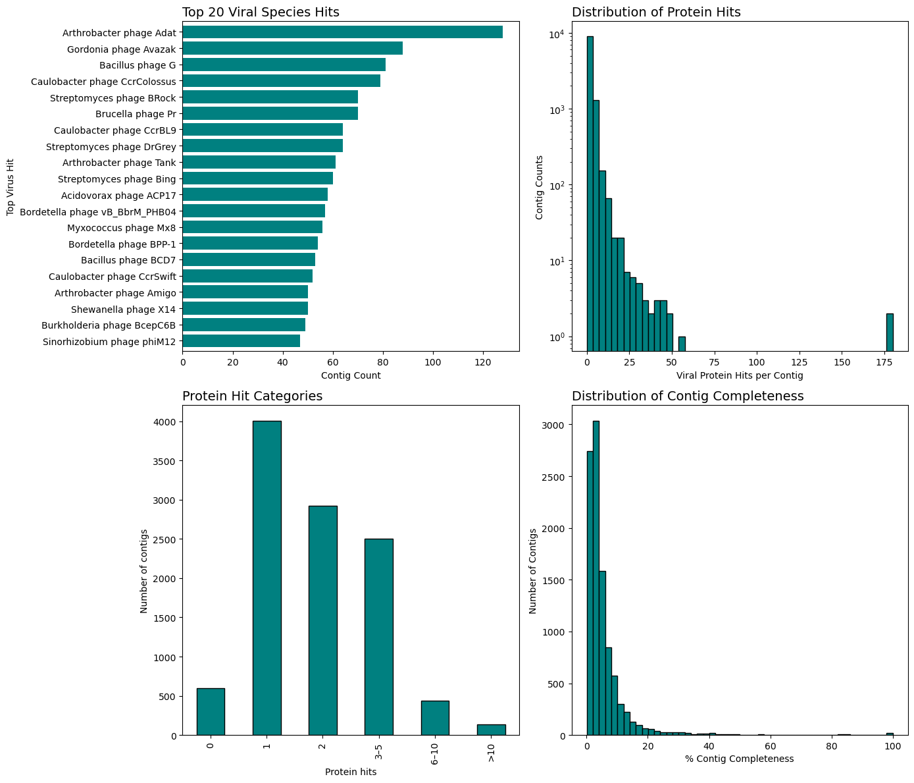

# Crassify: Protein-Based Viral Taxonomy Tool


**Crassify** is a high-throughput, fast tool for computing relatedness between viral genomes using whole-proteome pairwise protein alignments. Designed for metagenomic datasets, it enables:

- Rapid viral species detection
- Novelty detection
- MAG completeness estimation
- Phylogenetic distance estimation


Crassify uses **DIAMOND** to align input proteomes against a curated reference database of 14,329 ICTV-classified viral genomes.

## Installation

### Clone the repo and install dependencies:

```bash
git clone https://github.com/linda5mith/crassify.git
cd crassify/
mamba env create -f environment.yml
mamba activate crassify
# Install Crassify as a CLI command:
pip install -e .
```

### Test installation
```bash
crassify -i sample_data/test_phages_nucl/pooled_test_phages.fna -o ~/crassify_test
```

## 📄 Output

Crassify produces several output files:  

- **`percentage_viral.csv`** — per-genome summary of viral content, completeness, and novelty.  
- **`distances.csv`** — pairwise inter-genome distances and similarity metrics.  
- **`crassify_summary.png`** — quick visualization of input genomes and viral content.  

---

### `percentage_viral.csv`

| Column | Description |
|--------|-------------|
| `genome_ID` | Accession or identifier of the query genome/contig |
| `genome_length` | Total nucleotide length of the query genome |
| `protein_hits` | Number of proteins with at least one significant match |
| `top_species_hit` | Best-matching reference virus species |
| `top_species_hit_genome_accn` | Accession of the top reference genome |
| `sseqid_genome_length` | Length of the best-matching reference genome |
| `total_aln_length` | Summed alignment length across all proteins |
| `% contig viral` | Fraction of query genome aligning to viral proteins |
| `% contig completeness` | Completeness relative to the top reference genome |
| `#_proteins` | Number of predicted proteins in the query genome |
| `% proteins aligned` | Percentage of proteins with hits in the reference DB |
| `novelty_score` | Higher = more novel (penalizes low alignment/completeness) |
| `is_novel` | Boolean flag (True if `novelty_score > 60`) |

---

### `distances.csv`

| Column | Description |
|--------|-------------|
| `qseqid_genome_ID` | Query genome accession/ID |
| `sseqid_genome_ID` | Reference genome accession/ID |
| `sseqid_virus` | Virus name of the reference genome |
| `distance` | Inter-genome distance (lower = more similar) |
| `total_aln_length` | Summed amino acid alignment length |
| `avg_pid` | Average % identity across alignments |
| `avg_genome_length` | Average length of query and reference genomes |
| `qseqid_genome_length` | Query genome length |
| `sseqid_genome_length` | Reference genome length |

---

Example visualization:  


---

## Input Files

Crassify takes either:
- **Nucleotide sequences** (that get translated), or
- **Protein FASTA files** (`.faa`)  
  (All proteins for a given genome should be supplied together)
---

## Building and Compiling Your Own Reference Database

You can build a custom Crassify-compatible database using your own set of viral proteomes.

### Step 1: Create a DIAMOND Database

```bash
diamond makedb --in your_viral_proteomes.faa -d VIRAL_DB.dmnd
```

### Step 2: Update/or add metadata corresponding to your viral genomes 
Add metadata corresponding to your viral genomes in the format as seen in data/crassify_metadata.csv
